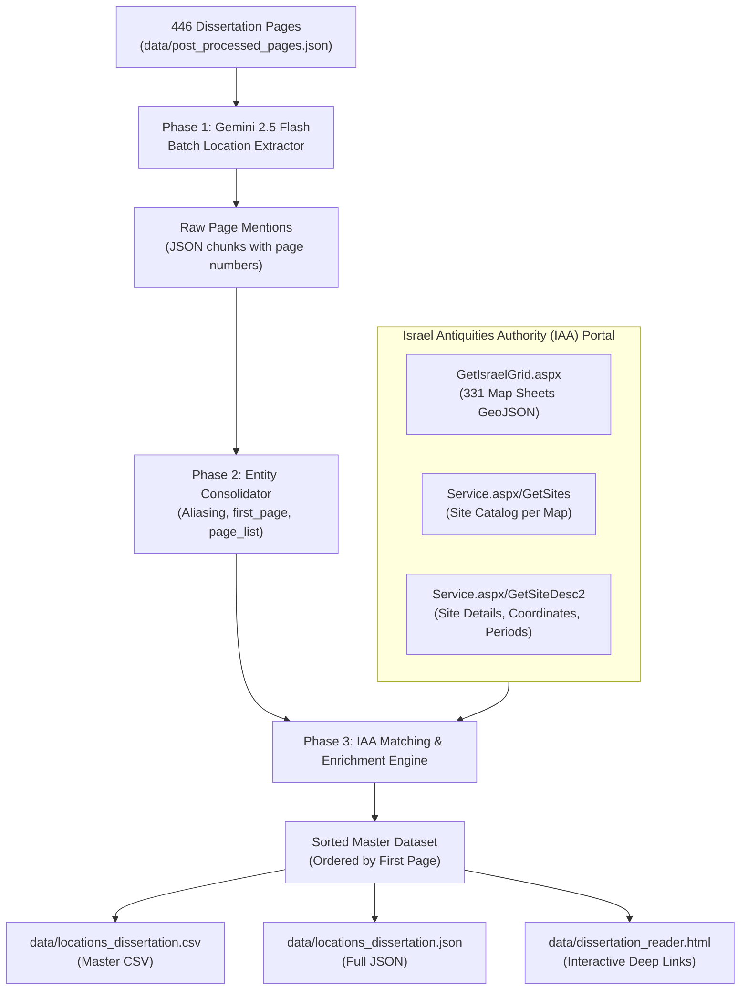

# Implementation Plan: Archaeological Location Extraction & IAA Portal Integration

## 1. Executive Summary & Objective

This document defines the complete technical implementation plan to extract all archaeological and geographical locations from **Dr. Zvika Tzuk's PhD dissertation** (*Ancient Water Systems in Settlements in Eretz-Israel from the Neolithic Period to the End of the Iron Age*, TAU 2000, 446 pages), cross-reference and enrich every location with the official **Israel Antiquities Authority (IAA) Archaeological Survey portal** ([survey.iaa.org.il](https://survey.iaa.org.il/)), and export an authoritative dataset sorted by the first appearance of each location.

---

## 2. Core Requirements (from `extract_locations.md`)

1. **Extraction**: Use Vertex AI Gemini API (`gemini-2.5-flash`) to identify every archaeological site, water installation, and geographic feature mentioned across all 446 pages.
2. **IAA Enrichment**: Use the IAA Archaeological Survey portal ([Hebrew](https://survey.iaa.org.il/) and [English](https://survey.iaa.org.il//index_Eng.html#/)) to pull official site names, map sheet numbers, site IDs, survey coordinates, periods, and direct report links.
3. **Sorting**: Sort the entire output list strictly in ascending order by **first occurrence** in the dissertation (`first_page` from 1 to 446).
4. **CSV Export**: Generate a structured CSV file with:
   - `Location Name` (Primary Hebrew name)
   - `English Name` (Primary English name)
   - `Hebrew Aliases` (List of aliases for the location in Hebrew)
   - `English Aliases` (List of aliases for the location in English)
   - `Site Type` (e.g. Tell, Cave, Installation, etc.)
   - `List of pages where the location is mentioned` (e.g. `8, 43, 44, 112, 198`)
   - IAA columns (IAA map sheet, IAA site ID, direct IAA URL).

---

## 3. Data Sources & Architecture

---

## 4. Technical Specifications & IAA API Integration

### 4.1. Official IAA Portal Endpoints (`survey.iaa.org.il`)
The IAA Survey portal operates on ASP.NET WebServices delivering structured JSON/GeoJSON:

| Endpoint | Method | Parameters | Description |
| :--- | :--- | :--- | :--- |
| `https://survey.iaa.org.il/aspxService/GetIsraelGrid.aspx` | `GET` | None | Returns all **331 archaeological survey map sheets** with bounding boxes, names, and map numbers. |
| `https://survey.iaa.org.il/aspxService/Service.aspx/GetSites` | `GET` | `?mapId={id}` | Returns all surveyed archaeological sites within a given map sheet. |
| `https://survey.iaa.org.il/aspxService/Service_Eng.aspx/GetSites` | `GET` | `?mapId={id}` | Returns English site names for all sites in the map sheet. |
| `https://survey.iaa.org.il/aspxService/Service.aspx/GetSiteDesc2` | `GET` | `?Id={site_id}` | Full site monograph: alternative names, grid coordinates, periods, installations, and survey report. |
| `https://survey.iaa.org.il/aspxService/Service.aspx/GetMapNameAndId` | `GET` | `?typed='{query}'` | Autocomplete search for map names. |

### 4.2. Direct IAA Web Portal Deep Links
For any site matched to an IAA survey record:
- **Hebrew Portal URL**: `https://survey.iaa.org.il/#/MapSurvey/{map_id}/site/{site_id}`
- **English Portal URL**: `https://survey.iaa.org.il//index_Eng.html#/MapSurvey/{map_id}/site/{site_id}`

---

## 5. Implementation Phases

### Phase 1: Full-Corpus Gemini Location Extraction
- **Script**: `scripts/extract_all_locations_gemini.js`
- **Input**: `data/post_processed_pages.json` (446 pages)
- **Batching**: 10 pages per LLM prompt with Vertex AI `gemini-2.5-flash` (`geotrends-2026`).
- **Prompt Logic**:
  - Instruct the model to extract every distinct entity matching:
    1. *Archaeological Sites & Tells* (e.g., תל מגידו, תל חצור, עתלית ים, באר אורה).
    2. *Water Installations & Features* (e.g., בריכת גבעון, נקבת השילוח, בארות עובדה).
    3. *Geographic & Regional Features* (e.g., בקעת עובדה, הר מנשה, נחל קנה, הר סדום).
    4. *International Comparative Sites* (e.g., ג'ווה, מיקנה, אבלה, טפה גאורה, קטנה).
  - Extract per entity:
    - `canonical_hebrew`: Primary Hebrew location name (e.g., `תל מגידו`).
    - `canonical_english`: Primary English location name (e.g., `Tel Megiddo`).
    - `hebrew_aliases`: Array of alternative Hebrew names/spellings found on that page (e.g., `["מגידו", "תל אל-מותסלם"]`).
    - `english_aliases`: Array of alternative English names/spellings (e.g., `["Megiddo", "Tell el-Mutesellim"]`).
    - `site_type`: Classification category (e.g., `Tell`, `Cave`, `Installation`, `Spring`, `Well`, `Settlement`, `Region`, `Comparative Site`).
    - `context_summary`: Brief mention context.
- **Resilience**: Incremental caching in `data/locations_raw/chunk_*.json`.

### Phase 2: Entity Resolution, Alias Aggregation & Sorting
- **Script**: `scripts/consolidate_locations.js`
- **Normalization & Alias Merging**:
  - Group mentions of the same physical site/feature under a single canonical record.
  - Compile the complete, deduplicated lists for:
    - `hebrew_aliases`: Combined unique Hebrew alias names.
    - `english_aliases`: Combined unique English alias names.
    - `site_type`: Normalized entity classification.
- **Occurrence Indexing**:
  - `first_page`: Minimum page number where the entity appears.
  - `pages`: Deduplicated, sorted array of all page numbers (e.g., `[8, 43, 44, 112, 198]`).
  - `page_count`: Total frequency count.
- **Sorting**: Order the consolidated dataset strictly in ascending order by `first_page` (Page 1 $\to$ Page 446).

### Phase 3: Automated IAA Survey Enrichment Engine
- **Script**: `scripts/enrich_iaa_locations.js`
- **Process**:
  1. **Pre-fetch & Cache IAA Survey Index**: Download and cache the complete list of 331 map sheets and site rosters from `survey.iaa.org.il` locally (`.iaa_cache/`).
  2. **Multi-Strategy Matching**:
     - *Strategy A (Exact & Normalized Name Match)*: Compare canonical names and aliases against IAA `name_heb`, `name_eng`, and `additional_names`.
     - *Strategy B (Spatial Proximity Match)*: For dissertation sites where coordinates or survey map sheets are cited in Chapter 2, match against IAA site coordinates.
     - *Strategy C (Curated Archaeological Gazetteer)*: Join with `scripts/archaeological_gazetteer.js` for verified pinpoint installations.
  3. **Metadata Extraction**:
     - Official IAA Survey Map Number & Name (e.g., `מפת עתלית (31)`)
     - Official IAA Site ID
     - Direct IAA Portal URLs (Hebrew & English)
     - Old Israel Grid (ICS) & WGS84 Coordinates (converted via geodetic converter)
     - Archaeological Periods according to IAA
  4. **International Sites Handling**:
     - For sites outside Israel (Jordan, Syria, Lebanon, Iraq, Turkey, Greece, Egypt), assign country code, Pleiades/academic gazetteer coordinates, and mark as `International Site`.

### Phase 4: Output Generation & Reader Cross-Linking
- **Script**: `scripts/build_locations_csv.js`
- **Deliverables**:
  1. `data/locations_dissertation.csv` (Master CSV table formatted with the revised schema).
  2. `data/locations_dissertation.json` (Structured JSON).
  3. `data/dissertation_reader.html` update: Clickable page numbers linking directly to page anchors (e.g., `#page-43`).
  4. Git commit and push to `itzikst/LocationExtractor`.

---

## 6. Output CSV Schema

The resulting CSV file (`data/locations_dissertation.csv`) will be structured as follows:

| Column Name | Description | Example |
| :--- | :--- | :--- |
| **Location Name** | Primary Hebrew name | `תל מגידו` |
| **English Name** | Primary English name | `Tel Megiddo` |
| **Hebrew Aliases** | Semicolon-separated list of Hebrew aliases & variants | `מגידו; תל אל-מותסלם` |
| **English Aliases** | Semicolon-separated list of English aliases & variants | `Megiddo; Tell el-Mutesellim; Armageddon` |
| **Site Type** | Entity classification (Tell, Cave, Installation, Spring, Region, etc.) | `Tell / Fortified City` |
| **List of pages where the location is mentioned** | Comma-separated list of dissertation pages | `10, 58, 62, 120, 150, 198, 240` |
| **First Occurrence Page** | Earliest appearance page in dissertation (sorting key) | `10` |
| **IAA Survey Map** | Official IAA Map sheet number and name | `מפת מגידו (34)` |
| **IAA Site ID** | Official IAA internal record ID | `4215` |
| **IAA Portal URL** | Direct link to IAA Hebrew survey sheet | `https://survey.iaa.org.il/#/MapSurvey/34/site/4215` |
| **IAA English Portal URL** | Direct link to IAA English survey sheet | `https://survey.iaa.org.il//index_Eng.html#/MapSurvey/34/site/4215` |
| **Latitude (WGS84)** | Decimal latitude | `32.58550` |
| **Longitude (WGS84)** | Decimal longitude | `35.18470` |

---

## 7. Performance, Cost & Timeline

- **LLM Invocations**: ~45 batch requests to Vertex AI `gemini-2.5-flash`.
- **IAA API Invocations**: Rate-limited batch requests with local disk caching to prevent redundant HTTP requests.
- **Estimated Runtime**: ~2–3 minutes for complete execution.
- **Estimated Cloud Cost**: < $0.05 on Vertex AI.

---

## 8. Milestone Checklist

- [ ] **Step 1**: Pre-fetch and cache all 331 IAA survey map sheets and site indexes (`.iaa_cache/`).
- [ ] **Step 2**: Implement `scripts/extract_all_locations_gemini.js` to extract Hebrew names, English names, Hebrew/English aliases, and site types from `data/post_processed_pages.json`.
- [ ] **Step 3**: Consolidate mentions, compile deduplicated alias arrays, and calculate sorted occurrence indexes (`first_page` 1 $\to$ 446).
- [ ] **Step 4**: Run automated IAA enrichment against the cached IAA survey database and archaeological gazetteer.
- [ ] **Step 5**: Generate `data/locations_dissertation.csv` and `data/locations_dissertation.json` conforming to the updated schema.
- [ ] **Step 6**: Verify sample matches, update Dissertation Reader page cross-links, and commit/push to GitHub.
